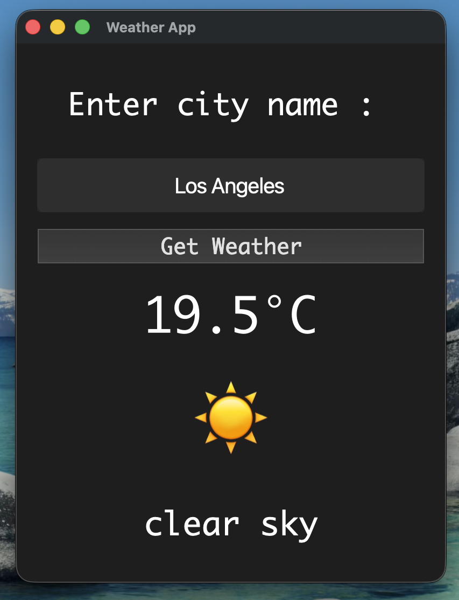

# 🌦️ Weather App (PyQt5)

A simple and elegant desktop weather application built using **Python** and **PyQt5**.
It fetches real-time weather data using the **OpenWeather API** and displays it in a clean graphical interface.

## ✨ Features
* 🔍 Search weather by city name
* 🌡️ Displays temperature in Celsius
* 🌤️ Weather condition with emoji
* 📝 Weather description (e.g., *clear sky*, *broken clouds*)
* ⚡ Fast and responsive UI (threaded API calls)
* 🎨 Clean and minimal interface

## 🖼️ Preview


## 🛠️ Tech Stack
* **Python**
* **PyQt5** (GUI)
* **Requests** (API calls)
* **OpenWeather API**
* **python-dotenv** (for secure API key handling)

## ⚙️ Installation & Setup
### 1. Clone the repository
```bash
git clone https://github.com/pranjalmalhotra031/weather-app.git
cd weather-app
```

### 2. Install dependencies
```bash
pip install -r requirements.txt
```

### 3. Create a `.env` file
Create a file named `.env` in the project root:
```env
API_KEY=your_openweather_api_key_here
```

> 🔐 Your API key is kept secure using environment variables.

### 4. Run the application
```bash
python weather_app.py
```

## 📁 Project Structure
```
weather-app/
│── weather_app.py
│── .env              # (not uploaded to GitHub)
│── .gitignore
│── requirements.txt
│── README.md
│── assets/
│    └── screenshot.png
```

## ⚠️ Important Notes
* ❌ Do NOT upload your `.env` file to GitHub
* 🔑 If your API key is exposed, regenerate it immediately
* 🌐 Requires internet connection to fetch weather data

## 🚀 Future Improvements
* 🌡️ Toggle between °C and °F
* 📍 Auto-detect current location
* 💧 Show humidity and wind speed
* 🌙 Dark / Light mode toggle
* ⏳ Add loading spinner animation
* 📅 Weather forecast (next 5 days)

## 🤝 Contributing
Feel free to fork this repository and improve it!
Pull requests are welcome.

## 📄 License
This project is open source and available under the **MIT License**.

## 🙌 Acknowledgements
* [OpenWeather](https://openweathermap.org/) for the API
* PyQt5 for GUI framework

⭐ If you like this project, consider giving it a star!
